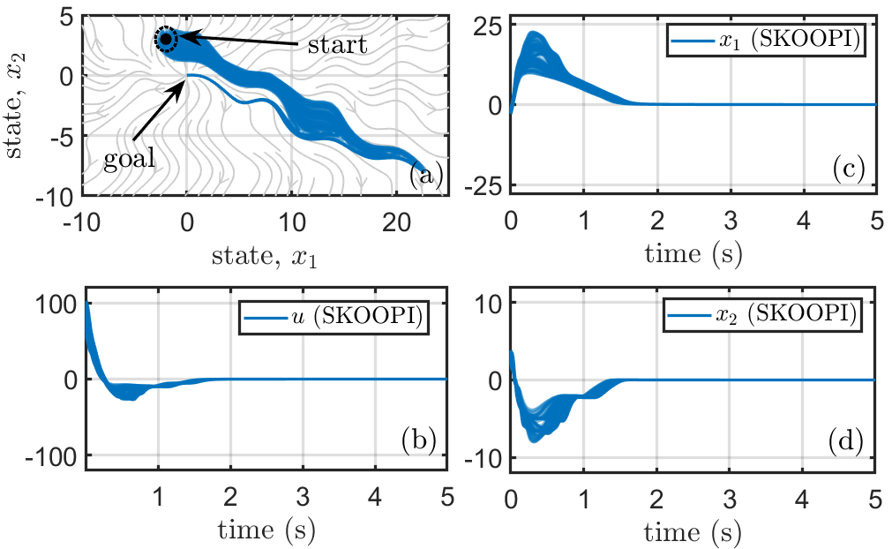
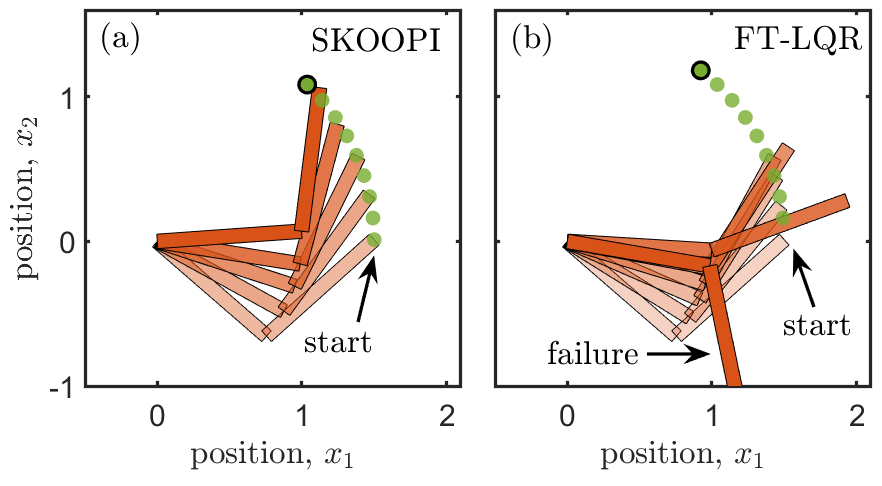
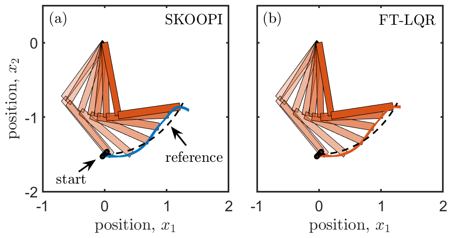

# SKOOPI: Spectral KOopman Approach to Optimal Control Using Path-Integral Formulation

This paper presents a novel framework for computing optimal control by exploiting the spectral properties of the Koopman operator associated with the uncontrolled dynamical system. The innovative aspect lies in the ability to compute optimal control using information extracted from the open-loop system's behavior. A key advantage of this approach is that it does not require global knowledge of Koopman eigenfunctions. Instead, the optimal control at a given state is determined using the gradient (local information) of the Koopman eigenfunction. The eigenfunction values are computed using a path-integral formula, which is particularly appealing as it only requires open-loop trajectory information starting from the state of interest. By relying solely on local trajectory data, the approach offers a scalable and efficient solution for optimal control computation without explicit knowledge of the system dynamics. 

## Example 1: Stabilization

## Example 2: Trajectory Tracking

Case 1:

Case 2:

